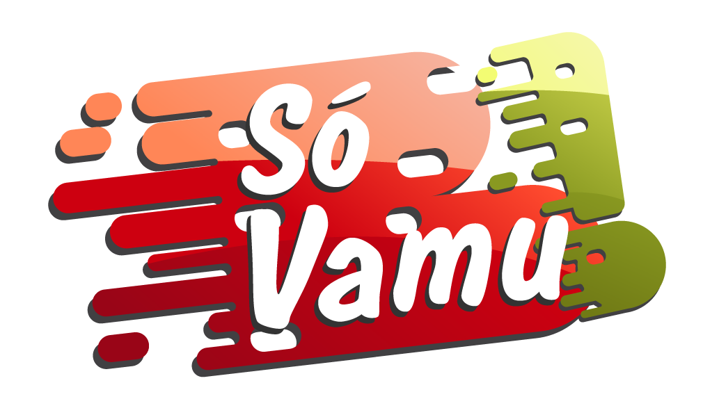

<h1>
 
 <h1>
 
 <h1 align = "center"> 
 
    Trilha Angular FrontEnd 
<h1>

## Desafio Proposto Nº3 ## 

## FLEX BOX ##

A)Flex box é uma solução de layout para alinhar e distribuir dentro de um container com itens flexiveis que se ajustam a resoluções.

B)O eixo principal é definido atraves da proprieda flex-direction, podendo ter quatro valores possiveis
Rom:linha(ele se moverá no eixo da linha)
Rom-reverse:linha reversa (ele se moverá para trás)
Colun: coluna, o eixo se move até o topo até o fim da página
Colun-reverse:faz o sentido reverso

C)O eixo transversal é perpendicular ao eixo principal, logo, se a propriedade flex-direction estiver definida nas linhas, como row ou row-reverse, o eixo transversal estará na direção das colunas, como column ou column-reverse.
Se o eixo principal for definido nas colunas, como column ou column-reverse, então o eixo transversal estará na direção das linhas, como row ou row-reverse.

D)Um flex container é o elemento pai, onde colocamos o display, a partir dessa estrutura utilizamos os elementos filhos.

E)Um flex item são como se fosse os elementos filhos dentro de um container.

F)A propriedade  CSS flex-wrap pode ser definida como uma linha que pode ser usada para ser quebrada. Se for valido, ele define uma direção em que as linhas são empilhadas.

G)Podemos fazer em três propriedades são elas:
Flex-basic: que define o tamanho inicial dos elementos em px e o seu valor inicial é auto9automático).
Flex-shrink: com essa propriedade podemos fazer a redução da largura dos elementos.
Flex- grow:com essa propriedade podemos distribuir o espaço proporcionalmente entre elementos de um container.

H)Podemos fazer da seguinte forma:
Alinhamento: com a propriedade aling-items irá alinhar os elementos no eixo transversal,
